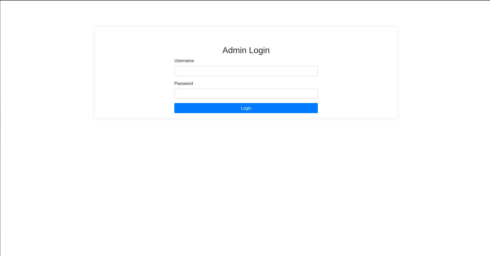

# Admin Authentication

- **Login:** Admins log in using credentials from the `.env` file.
    
- **Session Management:** Sessions are used to track admin login status.
- **Logout:** Admins can log out, which clears their session.

